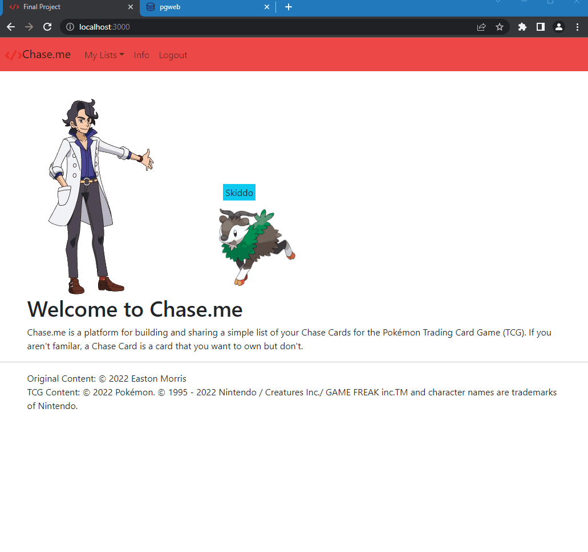
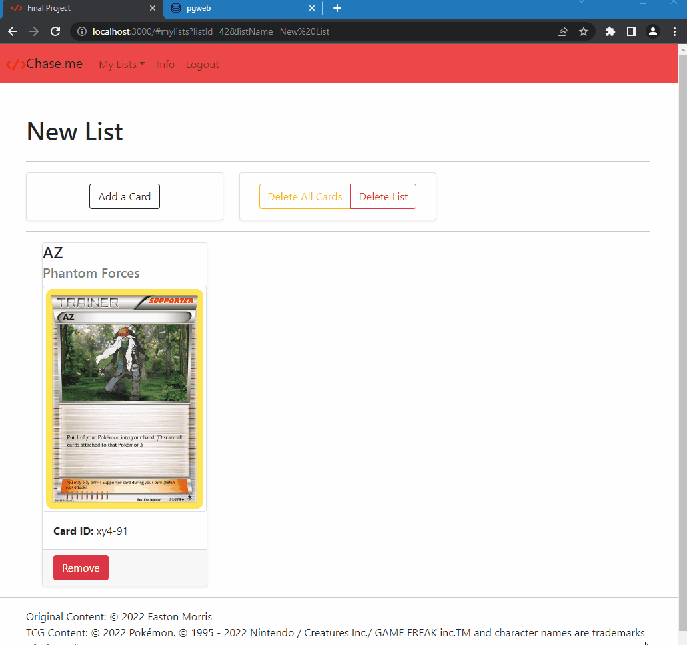

# Chase.me

A full stack JavaScript solo project.

## Description

An app for displaying the Pokémon cards that you are looking for!

### Purpose

I always enjoyed Trading Card Games (TCGs) moreso for their social and creative
sides but also for the market-like trading space. It can be easy to TELL people
what cards you are looking for, but it is even better when you can SHOW them.

So, I created Chase.me for an easy way to do just that for the Pokémon TCG.

Link to the app: (https://em-chase-me.herokuapp.com/)

### Tech Stack

* HTML 5
* CSS
* JavaScript
* Node.js
* React.js
* Bootstrap 5
* PostgreSQL
* Argon2
* Webpack
* Express
* JSON Web Token
* Heroku
* [The Pokémon TCG API](https://dev.pokemontcg.io/)

#### Key Features

1. A User can create a list(s) and give it a name
2. A User can add a card to their list (no duplicates)
3. A User can remove a card from their list
4. A User can clear their list of all cards
5. A User can delete their list
6. A User can create an account and sign in
7. User can search for the card they want
8. Header navigation between pages

#### The App In Action





#### Stretch Features

1. One click share list to Social Medias
2. Current Market Valuation for Cards on List

### System Requirements

1. Your favorite IDE
2. Git
3. Node.js 18 or higher
4. PostgreSQL 14 or higher
5. NPM 6 or higher

## Getting Started

1. Download and configure Git and GitHub: (https://www.w3schools.com/git/default.asp?remote=github)

2. Download your favorite IDE. I recommend [VS Code](https://code.visualstudio.com/download)

3. Download [Node](https://nodejs.org/en/download/)

4. Download [PostgreSQL](https://www.postgresql.org/about/)

5. Download [NPM](https://docs.npmjs.com/getting-started)

6. Then head back here and clone the repository.

```shell
    git clone https://github.com/easton-morris/chase-me.git
    cd sgt-react
```

7. Go to [The Pokémon TCG API](https://dev.pokemontcg.io/) and create an account.
Use their documentation to obtain an API key.

8. Make a copy of the .env.example file and name it .env. Then, update the config
values with your Database name, API key, and Token Secret for JSON Web Tokens.

9. Install all dependencies with NPM.

```shell
    npm install
```

10. Setup and import the example database. Fill it with cards. Then view it on pgweb. (Make sure PostgreSQL is running!)

```shell
    createdb my-chaseme

    npm run db:import

    npm run cards /* updates Database with latest cards from API */

    pgweb --db=my-chaseme
```

11. Start the project. Once started you can view the application by opening (http://localhost:3000) in your browser.

```shell
    npm run dev
```
